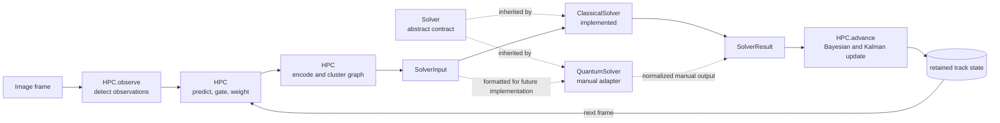

# Interpretable cell detection and data association

This project turns microscopy images into cell observations, associates those
observations over time, and makes every intermediate decision available for
inspection. The object-oriented interface has two clear responsibilities:
the Hypothesis Processing Controller (`HPC`) owns image preprocessing and
tracking state, while a `Solver` chooses a consistent set of weighted
associations. `ClassicalSolver` is implemented and usable. `QuantumSolver` is
intentionally only a documented neutral-atom input/output adapter; the physical
solver is left for a later manual implementation.

No population of global hypotheses is retained. Candidate associations exist
for one frame, the selected result updates one state per track, and the local
candidates are then discarded.

## Model



The loop is deliberately visible: an image goes to `HPC`, immutable graph
problems go to a solver, and the common solver result returns to `HPC` before
the next frame is processed.

## Installation

Python 3.11 or newer is required.

```powershell
python -m pip install -e ".[test,notebook]"
python -m pytest
```

To reproduce the pinned numerical environment used for the detection
artifacts, constrain the runtime dependencies during installation:

```powershell
python -m pip install -c requirements-detection-lock.txt -e .
```

Launch the root-level interface with:

```powershell
cell-detect prepare-data
jupyter lab user_notebook.ipynb
```

The notebook has three cells—imports, configuration, and run—and processes
the real sequence-01 frame `data/PhC-C2DL-PSC/01/t000.tif`. Its import cell
adds the local `src/` directory explicitly, so it also works from an
uninstalled source checkout when opened from the repository root.

## Object-oriented interface

The usual entry point is short:

```python
from neutral_atom_mht import ClassicalSolver, HPC, HPCConfig

hpc = HPC(HPCConfig())
solver = ClassicalSolver()
history = hpc.run_sequence(images, solver=solver)
```

The class uses Python's conventional `HPC` spelling; the package also exports
`hpc` as an exact lowercase class alias for interactive use.

`images` is any ordered iterable of two-dimensional image arrays. For each
frame, `run_sequence()` calls the same public stages that are available for
interactive use:

```text
observe image
  -> predict tracks
  -> gate observations
  -> calculate Bayesian association weights
  -> filter candidates
  -> encode and cluster the conflict graph
  -> create immutable SolverInput objects
  -> Solver.solve(...)
  -> apply Bayesian/Kalman updates
  -> filter retained tracks
```

The main object responsibilities are:

| Object | Responsibility |
| --- | --- |
| `HPC` | Converts images to observations, exposes every preprocessing stage, owns retained track state, creates solver inputs, validates solver results, and advances the sequence. |
| `Solver` | Defines the shared `solve(SolverInput) -> SolverResult` contract. It does not detect cells or mutate tracks. |
| `ClassicalSolver` | Computes an exact maximum-weight independent set for each graph cluster, subject to its declared size limit. |
| `QuantumSolver` | Serializes a common problem for a future neutral-atom implementation and validates a supplied response as a common solver selection. It performs no optimization or simulation today. |

For inspection, call `observe()`, `prepare_frame()`, `solve()`, and `advance()`
separately. `prepare_frame()` is read-only and exposes its predictions, gates,
weighted candidates, graph, clusters, and solver inputs. `step()` is the
one-frame convenience method; `run_sequence()` repeats it over many images.
The notebook keeps the interface deliberately smaller: it prepares, solves,
and advances one real dataset frame without redefining package algorithms.

## Association model

An observation has a frame-local identifier, position `(x, y)`, and a `2 x 2`
measurement covariance. A retained track has one Kalman state
`(x, y, vx, vy)`, its covariance, existence log odds, and observation history.
An association candidate means only:

> retained track `i` generated observation `j` in the current frame.

Two candidates conflict when they reuse the same track or the same
observation. Each candidate is a graph node and each conflict is an edge, so a
valid association decision is an independent set.

### Gating

For innovation `nu` and innovation covariance `S`, the statistical gate uses

```text
d_squared = nu.T @ inv(S) @ nu.
```

The boundary is inclusive: a pair is retained when `d_squared` is no greater
than the configured threshold. An optional Euclidean innovation-distance gate
is a distinct second test; it is not described as a speed gate.

### Bayesian weights and updates

Track existence is stored as log odds:

```text
L = log(P(exists) / (1 - P(exists))).
```

For detection probability `P_D` and uniform clutter spatial density
`beta_FA`, a gated two-dimensional hit contributes

```text
d_hit = log(P_D) - log(beta_FA) - log(2*pi)
        - 0.5*log(det(S)) - 0.5*nu.T @ inv(S) @ nu.
```

A miss contributes:

```text
d_miss = log(1 - P_D).
```

Every posterior uses `L_new = L_old + d` and
`P_new = 1 / (1 + exp(-L_new))`. Because every unselected track receives the
same miss update, the graph weight is the incremental assignment benefit
`d_hit - d_miss`. These calculations belong to `HPC`, so every solver receives
identical weights and cannot apply a private probability update.

## Solver contract

Each graph cluster is frozen as a `SolverInput` with a canonical SHA-256
fingerprint. Every solver returns the same `SolverResult` fields:

```text
schema_version, problem_id, input_fingerprint, solver_name,
selected_ids, objective, feasible, status, runtime_seconds, diagnostics
```

`HPC` validates that selected identifiers exist, do not conflict, and reproduce
the objective from the original graph weights. Only a validated successful
result may advance tracking state.

`ClassicalSolver` returns `optimal` for a solved problem and reports its size
limit explicitly rather than changing the problem. `QuantumSolver` reports
`not_implemented`; it does not call QuTiP, model a Rydberg Hamiltonian, claim
Pasqal-device compatibility, synthesize a quantum answer, or fall back to the
classical algorithm. Its `format_input()` and `format_output()` methods define
the manual integration boundary for later work.

## Cell detection and gold-standard evaluation

The repository uses only **PhC-C2DL-PSC sequence 01** from the Cell Tracking
Challenge. The retained source data are:

- `01/`: 300 raw phase-contrast frames;
- `01_GT/TRA/`: human tracking markers used only as post-hoc detection gold.

Challenge test data, sequence 02, silver-standard `ST` annotations, and
relabelled error masks are not used. Source images are local and ignored by
Git. Prepare them and reproduce the benchmark with:

```powershell
cell-detect prepare-data
cell-detect run
```

The detector is deterministic:

```text
Gaussian denoise
  -> broad-background subtraction
  -> Otsu-derived high-confidence seeds
  -> morphology and seed-area filtering
  -> connected low-threshold support
  -> nearest-seed assignment within each component
  -> final-area filtering
```

Gold labels never enter detection. A detection event is strictly one positive
final instance label in one frame, represented as:

```text
(sequence, frame, detection_id, x_px, y_px, area_px, source)
```

Coordinates are zero-based pixels with the origin at the upper left;
`x_px = column` and `y_px = row`. Prediction identifiers are frame-local. Gold
identifiers retain their source labels, but evaluation does not treat either
identifier as a cross-frame identity.

Predictions and gold centroids are matched independently per frame by
maximum-cardinality one-to-one assignment inside an inclusive Euclidean gate;
minimum total distance breaks cardinality ties. The primary figure of merit is
micro-averaged centroid F1 at a fixed 10 px gate:

```text
F1 = 2 * sum(TP) / (sum(predicted) + sum(gold)).
```

Across all 300 frames, the versioned run contains 50,622 true positives,
8,104 false positives, and 20,781 false negatives: precision `0.862`, recall
`0.709`, micro F1 `0.778`, and localization RMSE `3.692 px`. Exact events,
matches, frame metrics, 5/10/15 px sensitivity, figures, parameters, software
versions, and hashes are stored directly under `artifacts/`:

```text
artifacts/
  detections.csv
  gold_events.csv
  matches.csv
  per_frame_metrics.csv
  summary.json
  detections_overview.png
  performance_over_time.png
```

`summary.json` fingerprints all 300 source pairs. The raw-frame SHA-256 is
`46c15979d995a6e8f3bbbed78652965c7575fba8f4d49da87493903e051b90fa` and the
human-gold SHA-256 is
`4795100971222e24686c8dae8532c24d4c99d7401c08b418937b2968dd56f01b`.

## Project layout

```text
README.md                         this complete project guide
user_notebook.ipynb               three-cell real-frame user interface
pyproject.toml                    package and test configuration
requirements-detection-lock.txt  artifact reproduction environment
artifacts/                        flat, versioned detection evidence
src/neutral_atom_mht/
  hpc.py                          stateful image-to-association controller
  solver.py                       abstract solver and common data contract
  classical_solver.py             implemented exact graph solver
  neutral_atom.py                 documented manual quantum adapter
  models.py                       observations, tracks, and candidates
  filtering.py                    Kalman prediction and update
  gating.py                       statistical and distance gates
  likelihood.py                   Bayesian weights and posterior updates
  graph.py                        graph encoding, clustering, and plotting
  detection.py                    deterministic cell detector
  evaluation.py                   gold-standard matching and metrics
  data.py                         sequence-01 acquisition and validation
  io.py                           artifact serialization
  visualization.py               detection figures
  benchmark.py                    reproducible detection benchmark
  cli.py                          command-line entry point
tests/                            unit and end-to-end tests
```

Each source file begins with a plain-language module description stating what
it receives, what it produces, and which responsibility it deliberately does
not own. The flat modules preserve those boundaries without forcing users to
navigate nested solver or tracking packages.

## Current limitations

- Neutral-atom solving is a documented extension point, not an implementation.
- The exact classical solver has exponential worst-case complexity and a
  declared node cap.
- Detection parameters are fixed for interpretability rather than learned or
  adapted per frame.
- Source TIFF files are not versioned; `summary.json` hashes establish the
  provenance of the published benchmark artifacts.
