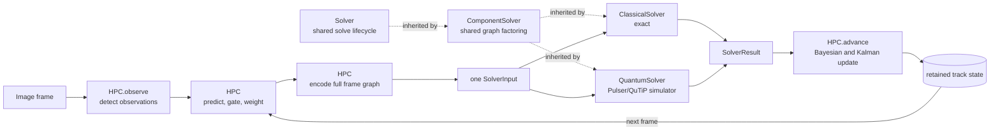

# Neutral-atom quantum computing for multi-hypothesis tracking

This project turns microscopy images into cell observations, associates those
observations over time, and makes every intermediate decision available for
inspection. The Hypothesis Processing Controller (`HPC`) owns image
preprocessing and tracking state, while a `Solver` chooses a consistent set of
weighted associations. `ClassicalSolver` computes exact maximum-weight
independent sets; `QuantumSolver` is a Pulser/QuTiP neutral-atom quantum
adiabatic implementation of the same contract.

## Quick start

```powershell
python -m pip install -e ".[test,notebook]"
jupyter lab user_notebook.ipynb
```

**Run all cells — the notebook works out of the box.** It uses the real
sequence-01 frames when `data/PhC-C2DL-PSC/` is present, and otherwise
generates a local synthetic sequence automatically. In the notebook you can:

- run one frame end to end (detect, associate, plot the result);
- switch `solver = ClassicalSolver(maximum_component_nodes=60)` to
  `solver = QuantumSolver()` after
  installing the quantum extra (below);
- set `RUN_MANY_FRAMES = True` in the last cell to track over a sequence.

To use the quantum solver, install the optional Pulser simulation stack:

```powershell
python -m pip install -e ".[quantum]"
```

The quantum dependency is loaded lazily; the classical path never requires
Pulser. Run the tests with `python -m pytest`. The real Pulser/QuTiP smoke
test is opt-in because it runs the full embedding search and 40,000 ns pulse:

```powershell
$env:NEUTRAL_ATOM_INTEGRATION="1"
python -m pytest tests/test_neutral_atom_integration.py -q
```

## Model



An image goes to `HPC`, an immutable graph problem goes to a solver, and the
common solver result returns to `HPC` before the next frame is processed. No
population of global hypotheses is retained: candidate associations exist for
one frame, the selected result updates one state per track, and the local
candidates are then discarded.

## Object-oriented interface

```python
from neutral_atom_mht import ClassicalSolver, HPC, HPCConfig

hpc = HPC(HPCConfig())
solver = ClassicalSolver()
history = hpc.run_sequence(images, solver=solver)
```

`images` is any ordered iterable of two-dimensional image arrays. For
step-by-step inspection, call `observe()`, `prepare_frame()`, `solve()`, and
`advance()` separately; `prepare_frame()` is read-only and exposes its
predictions, gates, weighted candidates, full graph, and solver input.
`step()` is the one-frame convenience method.

| Object | Responsibility |
| --- | --- |
| `HPC` | Converts images to observations, owns retained track state, creates one full-frame solver input, validates its result, and advances the sequence. |
| `Solver` | Owns the shared `solve(SolverInput) -> SolverResult` lifecycle: timing, objective calculation, and validation. |
| `ComponentSolver` | Extends `Solver` with deterministic component factoring and a per-component capacity. |
| `ClassicalSolver` | Computes exact maximum-weight independent sets per connected component. |
| `QuantumSolver` | Embeds each supported component in a neutral-atom register, runs the Pulser/QuTiP simulation, and decodes feasible samples back to graph-node IDs. |

## Association model

An observation has a frame-local identifier, position `(x, y)`, and a `2 x 2`
measurement covariance. A retained track has one Kalman state
`(x, y, vx, vy)`, its covariance, existence log odds, and observation history.
A candidate means "track `i` generated observation `j` in this frame". Two
candidates conflict when they reuse the same track or observation, so a valid
association decision is an independent set in the conflict graph.

Gating keeps a pair when the Mahalanobis distance
`d_squared = nu.T @ inv(S) @ nu` is within the configured threshold (an
optional Euclidean innovation-distance gate is a distinct second test).
Track existence is stored as log odds; a gated hit contributes
`d_hit = log(P_D) - log(beta_FA) - log(2*pi) - 0.5*log(det(S)) - 0.5*d_squared`
and a miss contributes `d_miss = log(1 - P_D)`. Because every unselected track
receives the same miss update, the graph weight is the incremental benefit
`d_hit - d_miss`. These calculations belong to `HPC`, so every solver receives
identical weights.

## Solver contract

The complete frame graph is frozen as a single `SolverInput` with a canonical
SHA-256 fingerprint. Each solver owns any component decomposition it needs and
returns one `SolverResult`:

```text
schema_version, problem_id, input_fingerprint, solver_name,
selected_ids, objective, feasible, status, runtime_seconds, diagnostics
```

`HPC` validates that selected identifiers exist, do not conflict, and
reproduce the objective from the original graph weights; only a validated
result may advance tracking state.

`QuantumSolver` reports a usable simulated selection as `completed`, not
`optimal`, because sampling does not prove the maximum-weight solution.
Singleton and complete-clique components are resolved directly (the Rabi
heuristic requires at least one nonedge); every other supported component uses
the Pulser simulation. `NeutralAtomConfig` exposes `random_seed`,
`mapping_tolerance`, `mapping_max_iterations`, `pulse_duration_ns`,
`interaction_scale`, and `qutip_cache_dir`;
`QuantumSolver(maximum_component_nodes=16)` caps the exponentially scaling
state-vector simulation. Oversized components, negative weights, failed
embeddings, or missing feasible samples report `unsupported_size`,
`unsupported_weights`, `embedding_failed`, or `no_feasible_sample` atomically.
The defaults use `MockDevice` and `QutipBackendV2`, not Pasqal hardware.

To inspect one simulation, call `execute()` instead of `solve()` and pass its
run records to `NeutralAtomVisualizer`:

```python
from neutral_atom_mht import NeutralAtomVisualizer, QuantumSolver

solver = QuantumSolver()
execution = solver.execute(solver_input)
run = execution.runs[0]
visualizer = NeutralAtomVisualizer()
visualizer.save_distribution(run, "quantum-samples.png")
```

## Data

The optional real dataset is **PhC-C2DL-PSC sequence 01** from the Cell
Tracking Challenge. Source images are local and ignored by Git; place them as
`data/PhC-C2DL-PSC/01/t000.tif ... t299.tif` to have the notebook use them.

Synthetic Cell Tracking Challenge-style sequences are generated through the
same package interface, and the notebook falls back to them automatically:

```python
from neutral_atom_mht import SyntheticDataConfig, SyntheticDataGenerator

config = SyntheticDataConfig(noise=0.4, frame_count=20, object_count=30, seed=7)
dataset = SyntheticDataGenerator(config).generate()
image = dataset.load_frame(0)
```

By default this creates `data/synthetic/SYN-MHT/`, with raw images in `01/`
and tracking labels in `01_GT/TRA/`. Generated datasets are local and ignored
by Git; generation refuses to overwrite a nonempty dataset directory.

## Project layout

```text
README.md                this complete project guide
user_notebook.ipynb      the run-everything notebook interface
pyproject.toml           package and test configuration
data/                    local datasets (ignored by Git)
src/
  neutral_atom_mht.py    public package facade
  hpc.py                 stateful image-to-association controller
  solver.py              solver lifecycle, component parent, and data contract
  classical_solver.py    exact graph solver
  neutral_atom.py        Pulser/QuTiP solver and opt-in diagnostics figures
  models.py              observations, tracks, and candidates
  filtering.py           Kalman prediction and update
  gating.py              statistical and distance gates
  likelihood.py          Bayesian weights and posterior updates
  graph.py               graph encoding, clustering, and plotting
  detection.py           deterministic cell detector
  cell_data.py           local sequence-01 paths and loading
  synthetic_data.py      synthetic sequence generator and loaders
tests/                   unit and end-to-end tests
```

Each source file begins with a plain-language module description stating what
it receives, what it produces, and which responsibility it deliberately does
not own.

## Current limitations

- Neutral-atom solving uses a local QuTiP state-vector simulator. Its sampled
  result is heuristic, depends on the graph embedding, and is subject to the
  configured component-size cap; it is not a hardware or optimality claim.
- The exact classical solver has exponential worst-case complexity and a
  declared node cap.
- Synthetic data model controlled scenes and should not be treated as
  biological ground truth.
- Detection parameters are fixed for interpretability rather than learned or
  adapted per frame.
